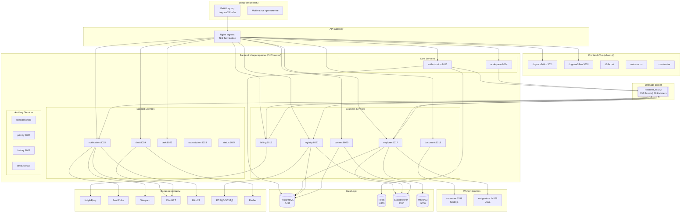
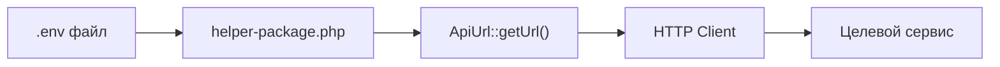
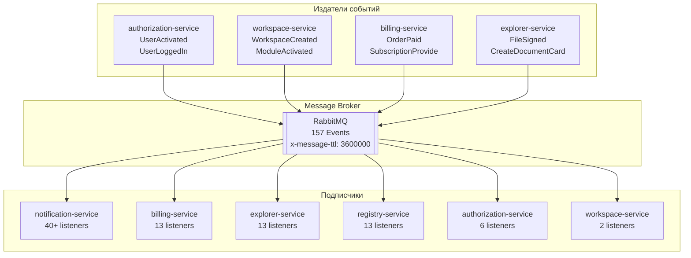
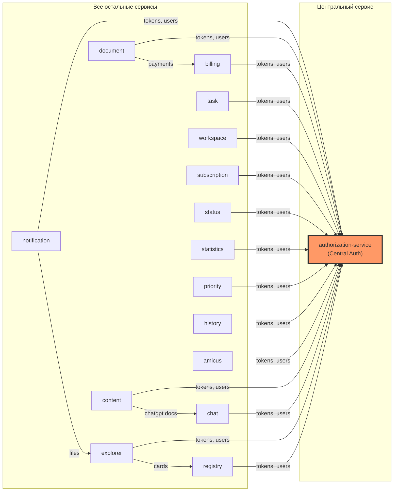
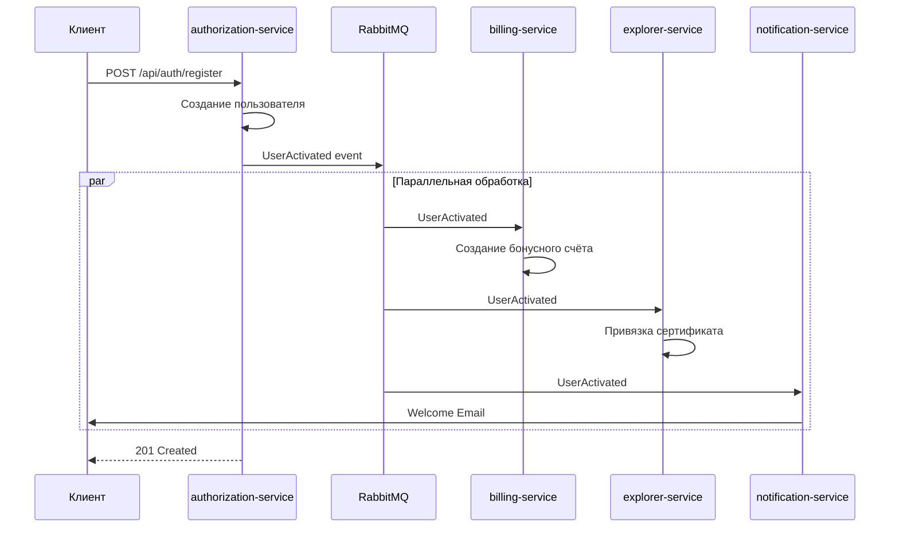
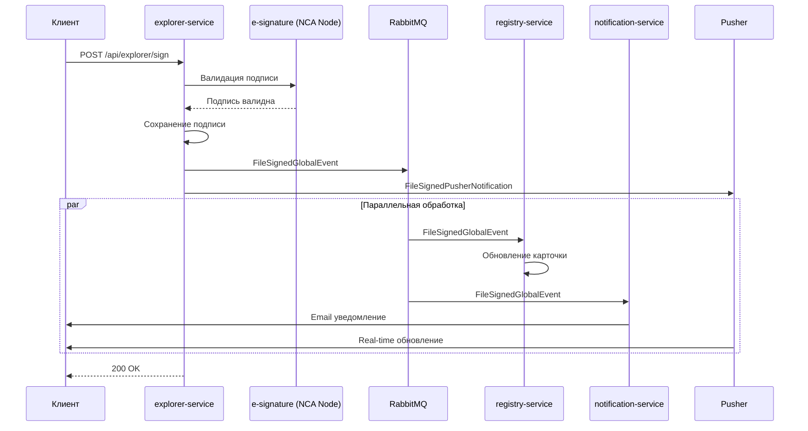
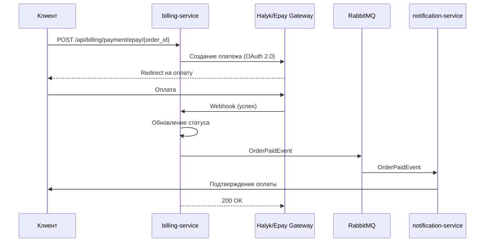
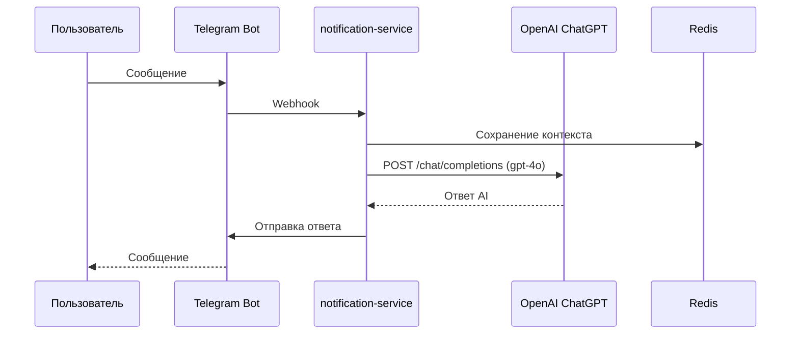

# Архитектура микросервисов Dogovor24

> **Последнее обновление:** Январь 2026
> **Всего микросервисов:** 24 (16 backend + 5 frontend + 3 worker)

## Содержание

- [Обзор системы](#обзор-системы)
- [Service Discovery](#1-service-discovery)
- [Межсервисные HTTP вызовы](#2-межсервисные-http-вызовы)
- [Асинхронные сообщения](#3-асинхронные-сообщения-event-driven-architecture)
- [Карта взаимодействия сервисов](#4-карта-взаимодействия-сервисов)
- [Shared Packages](#5-shared-packages)
- [Внешние интеграции](#6-внешние-интеграции)
- [Инфраструктура](#7-инфраструктура)
- [Типичные сценарии](#8-типичные-сценарии-взаимодействия)

---

## Обзор системы

Dogovor24 — это multi-tenant платформа электронного документооборота и цифровой подписи для Казахстана и России. Проект состоит из **16 backend-сервисов** на PHP Laravel, **5 frontend-приложений** на Vue.js/Nuxt.js и **3 worker-сервисов**.

### Backend-сервисы (PHP/Laravel)

| Сервис | Порт | Назначение | Префикс API |
|--------|------|-----------|-------------|
| **authorization-service** | 8013 | Авторизация, пользователи, роли, JWT токены | `/api/auth` |
| **workspace-service** | 8014 | Рабочие пространства, группы, модули, права | `/api/workspace` |
| **notification-service** | 8015 | Email, SMS, Telegram, WhatsApp, ChatGPT | `/api/notification` |
| **billing-service** | 8016 | Платежи, подписки, счета, транзакции | `/api/billing` |
| **explorer-service** | 8017 | Файлы, электронные подписи, маршрутизация | `/api/explorer` |
| **document-service** | 8018 | Документы, шаблоны, PDF генерация | `/api/document` |
| **chat-service** | 8019 | Чат, сообщения, ChatGPT ассистент | `/api/chat` |
| **content-service** | 8020 | CMS, конструктор документов | `/api/content` |
| **registry-service** | 8021 | Реестр документов, карточки, ЕСЭДО/ЭСУТД | `/api/registry` |
| **task-service** | 8022 | Задачи, резолюции, рабочие процессы | `/api/task` |
| **subscription-service** | 8023 | Управление подписками, тарифы | `/api/subscription` |
| **status-service** | 8024 | Статусы, состояния документов | `/api/status` |
| **statistics-service** | 8025 | Аналитика, статистика использования | `/api/statistics` |
| **priority-service** | 8026 | Приоритизация задач | `/api/priority` |
| **history-service** | 8027 | Аудит, история изменений | `/api/history` |
| **amicus-service** | 8028 | CRM, телефония, юридические услуги | `/api/amicus` |

### Worker-сервисы

| Сервис | Порт | Технология | Назначение |
|--------|------|------------|-----------|
| **converter** | 6789 | Node.js/Hapi.js | Конвертация документов (LibreOffice) |
| **e-signature** | 14579 | Java/NCANode | ЭЦП (НУЦ Казахстан) |
| **antivirus-api** | - | Node.js | Антивирусная проверка (ClamAV) |

### Frontend-приложения (Vue.js/Nuxt.js)

| Приложение | Порт(ы) | Назначение |
|------------|---------|-----------|
| **dogovor24** | 3011 (KZ), 3018 (RU) | Основное веб-приложение |
| **d24-chat** | - | Чат-компонент |
| **amicus-crm** | - | CRM интерфейс |
| **constructor** | - | Конструктор документов |
| **dogovor24-components** | - | Библиотека UI компонентов |

### Диаграмма полной архитектуры



---

## 1. Service Discovery

### Механизм обнаружения сервисов

Проект использует **конфигурацию через ENV переменные** — централизованный конфиг с URL всех сервисов.



### Центральный конфиг URL сервисов

**Файл:** `vendor/dogovor24/helper-package/src/config/helper-package.php`

```php
'api' => [
    'auth_url'         => env('API_BASE_URL', 'http://dogovor24.ru') . '/api/auth',
    'billing_url'      => env('API_BASE_URL', 'http://dogovor24.ru') . '/api/billing',
    'explorer_url'     => env('API_BASE_URL', 'http://dogovor24.ru') . '/api/explorer',
    'notification_url' => env('API_BASE_URL', 'http://dogovor24.ru') . '/api/notify',
    'workspace_url'    => env('API_BASE_URL', 'http://dogovor24.ru') . '/api/workspace',
    'registry_url'     => env('API_BASE_URL', 'http://dogovor24.ru') . '/api/registry',
    'document_url'     => env('API_BASE_URL', 'http://dogovor24.ru') . '/api/document',
    'chat_url'         => env('API_BASE_URL', 'http://dogovor24.ru') . '/api/chat',
    'content_url'      => env('API_BASE_URL', 'http://dogovor24.ru') . '/api/content',
    'task_url'         => env('API_BASE_URL', 'http://dogovor24.ru') . '/api/task',
    'subscription_url' => env('API_BASE_URL', 'http://dogovor24.ru') . '/api/subscription',
    'status_url'       => env('API_BASE_URL', 'http://dogovor24.ru') . '/api/status',
    'statistics_url'   => env('API_BASE_URL', 'http://dogovor24.ru') . '/api/statistics',
    'priority_url'     => env('API_BASE_URL', 'http://dogovor24.ru') . '/api/priority',
    'history_url'      => env('API_BASE_URL', 'http://dogovor24.ru') . '/api/history',
    'amicus_url'       => env('API_BASE_URL', 'http://dogovor24.ru') . '/api/amicus',
]
```

### Константы имён сервисов

**Файл:** `vendor/dogovor24/helper-package/src/Helper/ApiNames.php`

```php
const AMICUS_SERVICE        = 'amicus';
const AUTHORIZATION_SERVICE = 'auth';
const BILLING_SERVICE       = 'billing';
const CHAT_SERVICE          = 'chat';
const CONTENT_SERVICE       = 'content';
const DOCUMENT_SERVICE      = 'document';
const EXPLORER_SERVICE      = 'explorer';
const HISTORY_SERVICE       = 'history';
const NOTIFICATION_SERVICE  = 'notify';
const PRIORITY_SERVICE      = 'priority';
const REGISTRY_SERVICE      = 'registry';
const STATUS_SERVICE        = 'status';
const SUBSCRIPTION_SERVICE  = 'subscription';
const TASK_SERVICE          = 'task';
const WORKSPACE_SERVICE     = 'workspace';
```

### Настройка в .env

```env
# Единый базовый URL (рекомендуется)
API_BASE_URL=http://d24.test

# Или отдельно для каждого сервиса
AUTH_API_URL=http://auth-service.local
BILLING_API_URL=http://billing-service.local
EXPLORER_API_URL=http://explorer-service.local
# ... и так далее
```

---

## 2. Межсервисные HTTP вызовы

### Базовый HTTP клиент

**Файл:** `vendor/dogovor24/authorization-package/src/Services/AuthRequestService.php`

```php
class AuthRequestService
{
    public function getHttpClient($token = true, $systemUuid = false): Client
    {
        // Автоматически добавляет заголовки:
        // - Authorization: Bearer {token} (если $token = true)
        // - workspace-id (если есть в текущем запросе)
        // - region (из RegionService)
        // - system UUID (если $systemUuid = true — для системных запросов)

        return new Client([
            'base_uri' => $this->baseUrl,
            'verify'   => false,
            'headers'  => $this->headers
        ]);
    }
}
```

### Паттерн использования

```php
use Dogovor24\Authorization\Services\AuthRequestService;
use Dogovor24\Helper\Helper\ApiUrl;
use Dogovor24\Helper\Helper\ApiNames;

// 1. HTTP клиент с токеном текущего пользователя
$client = (new AuthRequestService())->getHttpClient(true, false);

// 2. Запрос к billing-service
$response = $client->get(
    ApiUrl::getUrl(ApiNames::BILLING_SERVICE) . '/account'
);

// 3. Системный запрос (без токена пользователя, с UUID системы)
$client = (new AuthRequestService())->getHttpClient(false, true);
$response = $client->post(
    ApiUrl::getUrl(ApiNames::NOTIFICATION_SERVICE) . '/send',
    ['json' => $payload]
);
```

### Матрица HTTP вызовов между сервисами

| Источник ↓ / Цель → | auth | billing | explorer | notify | registry | workspace | document | chat |
|---------------------|------|---------|----------|--------|----------|-----------|----------|------|
| **authorization** | - | | | | | | | |
| **billing** | ✓ | - | | | | ✓ | | |
| **explorer** | ✓ | | - | | ✓ | ✓ | ✓ | |
| **notification** | ✓ | | ✓ | - | ✓ | ✓ | | |
| **registry** | ✓ | | ✓ | | - | ✓ | | |
| **workspace** | ✓ | ✓ | | | | - | | |
| **document** | ✓ | ✓ | | | | | - | |
| **content** | ✓ | | | | | | | ✓ |
| **chat** | ✓ | | | | | | | - |
| **task** | ✓ | | | | | | | |
| **subscription** | ✓ | ✓ | | | | | | |

---

## 3. Асинхронные сообщения (Event-Driven Architecture)

### Message Broker

**RabbitMQ** — основной брокер сообщений для асинхронной коммуникации между сервисами.



### Конфигурация RabbitMQ

```env
QUEUE_CONNECTION=rabbitmq
RABBITMQ_HOST=rabbitmq
RABBITMQ_PORT=5672
RABBITMQ_USER=admin
RABBITMQ_PASSWORD=password
RABBITMQ_QUEUE=notification-service-queue
RABBITMQ_VHOST=/
RABBITMQ_QUEUE_ARGUMENTS={"x-message-ttl": 3600000}
```

### Общая библиотека событий

**Package:** `dogovor24/queue-package` (версия 1.13.*)

Содержит **157 событий** в `vendor/dogovor24/queue-package/src/Events/`

### Категории событий

| Категория | Примеры событий | Кол-во |
|-----------|-----------------|--------|
| **User Events** | `UserActivated`, `UserLoggedIn`, `UserEmailUpdatedEvent`, `UserIdentityConfirmedEvent` | 23+ |
| **Billing Events** | `OrderPaidEvent`, `SubscriptionProvideEvent`, `CreateProductOrder` | 8+ |
| **Explorer Events** | `FileSignedGlobalEvent`, `CreateExplorerFile`, `FolderDeletedEvent` | 30+ |
| **Registry Events** | `CreateDocumentCardEvent`, `CardUpdatedEvent`, `DeleteDocumentCardEvent` | 7+ |
| **Workspace Events** | `WorkspaceCreatedEvent`, `WorkspaceUserConfirmEvent`, `WorkspaceModuleActivatedEvent` | 7+ |
| **Notification Events** | `TaskCreatedNotifyEvent`, `MessageEvent` | 5+ |
| **Chat Events** | `NewMessageEvent`, `UpdateMessageEvent`, `DeleteMessageEvent` | 5+ |

### Публикация события

```php
use Dogovor24\Queue\Events\UserActivated;

// Способ 1: broadcast() метод (рекомендуется)
(new UserActivated($userId, $userData))->broadcast();

// Способ 2: Laravel event()
event(new UserActivated($userId, $userData));
```

### Подписка на события

**Файл:** `app/Providers/EventServiceProvider.php`

```php
protected $listen = [
    // Событие активации пользователя
    \Dogovor24\Queue\Events\UserActivated::class => [
        \App\Listeners\CreateUserBonusListener::class,
        \App\Listeners\SendWelcomeNotificationListener::class,
    ],

    // Событие оплаты заказа
    \Dogovor24\Queue\Events\OrderPaidEvent::class => [
        \App\Listeners\NotificationOrderPayedListener::class,
    ],

    // Событие подписания файла
    \Dogovor24\Queue\Events\FileSignedGlobalEvent::class => [
        \App\Listeners\FileSignedListener::class,
        \App\Listeners\SignatureStatusNotification::class,
    ],
];
```

### Таблица ключевых событий и подписчиков

| Издатель | Событие | Подписчики |
|----------|---------|------------|
| authorization | `UserActivated` | billing, explorer, notification, registry |
| authorization | `UserLoggedIn` | notification |
| authorization | `UserEmailUpdatedEvent` | notification, explorer |
| explorer | `FileSignedGlobalEvent` | authorization, notification, registry |
| explorer | `CreateExplorerFile` | registry |
| explorer | `CreateDocumentCardEvent` | registry, notification |
| workspace | `WorkspaceCreatedEvent` | explorer, billing, notification |
| workspace | `WorkspaceUserConfirmEvent` | notification |
| workspace | `WorkspaceModuleActivatedEvent` | notification |
| billing | `OrderPaidEvent` | notification |
| billing | `SubscriptionProvideEvent` | notification |

---

## 4. Карта взаимодействия сервисов

### HTTP зависимости



---

## 5. Shared Packages

Все сервисы используют общие библиотеки из приватного Bitbucket репозитория:

| Package | Версия | Назначение | Используется в |
|---------|--------|-----------|----------------|
| `dogovor24/authorization-package` | 1.2.* | HTTP клиент, JWT токены, `AuthRequestService`, `AuthUserService`, `RegionService` | Все сервисы |
| `dogovor24/helper-package` | 1.1.* | `ApiUrl`, `ApiNames`, утилиты, API routing | Все сервисы |
| `dogovor24/queue-package` | 1.13.* | 157 событий, RabbitMQ интеграция | Все сервисы |
| `dogovor24/workspace-package` | 1.1.* | `WorkspaceService`, `WorkspaceUserService` | 5 сервисов |
| `dogovor24/notification-package` | 2.0.* | Broadcast события, Pusher интеграция | notification, explorer |
| `dogovor24/filter-package` | dev-master | Фильтрация данных | auth, explorer, notification |

### Ключевые классы authorization-package

```
vendor/dogovor24/authorization-package/
├── src/
│   ├── Services/
│   │   ├── AuthRequestService.php    # HTTP клиент с авторизацией
│   │   ├── AuthUserService.php       # Работа с пользователями
│   │   ├── AuthUuidService.php       # Системные UUID
│   │   └── RegionService.php         # Работа с регионами (kz/ru)
│   └── Middleware/
│       └── JwtMiddleware.php         # JWT аутентификация
```

---

## 6. Внешние интеграции

### Платёжные системы

| Система | Сервис | Интеграция | Регион |
|---------|--------|------------|--------|
| **Halyk Bank / Epay** | billing-service | REST API (OAuth 2.0) | Казахстан |

**Endpoints:**
- OAuth (test): `https://testoauth.homebank.kz/epay2/oauth2/token`
- OAuth (prod): `https://epay-oauth.homebank.kz/oauth2/token`

### Уведомления

| Канал | Провайдер | Сервис | Интеграция |
|-------|-----------|--------|------------|
| **Email** | Mailgun, SendPulse | notification-service | REST API |
| **SMS** | SMSC | notification-service | Custom Driver |
| **WhatsApp** | SendPulse | notification-service | REST API |
| **Voice IVR** | Zvonobot | notification-service, subscription-service | REST API |
| **Telegram** | Telegram Bot API | notification-service | SDK |

### AI интеграция

| Сервис | Провайдер | Модель | Назначение |
|--------|-----------|--------|-----------|
| **ChatGPT** | OpenAI | gpt-4o | Помощник по документам |

**Конфигурация:**
```php
// config/chat-gpt.php
'model' => 'gpt-4o',
'max_completion_tokens' => 16383,
'temperature' => 0,
'endpoint' => '{api_host}/chat/completions'
```

### CRM и Телефония

| Система | Сервис | Интеграция |
|---------|--------|------------|
| **Bitrix24 CRM** | notification-service | REST API (Webhooks) |
| **OnlinePBX** | amicus-service | REST API |

### Государственные системы (Казахстан)

| Система | Сервис | Интеграция | Назначение |
|---------|--------|------------|-----------|
| **ЕСЭДО/ЭСУТД** | registry-service | SOAP/WSDL | Обмен документами |
| **НУЦ (NCA PKI)** | e-signature | REST API | Электронная подпись |

### Real-time

| Система | Сервисы | Назначение |
|---------|---------|-----------|
| **Pusher** | chat-service, frontend | WebSocket сообщения |

### Аналитика и мониторинг

| Система | Назначение |
|---------|-----------|
| **Google Tag Manager** | Аналитика (frontend) |
| **Yandex Metrics** | Аналитика (frontend) |
| **Sentry** | Error tracking (все сервисы) |
| **PHP-FPM Exporter** | Метрики (backend) |

---

## 7. Инфраструктура

### Data Layer

| Компонент | Технология | Версия | Порт | Назначение |
|-----------|------------|--------|------|-----------|
| **Database** | PostgreSQL | 9.6.11 | 5432 | Основная БД |
| **Cache** | Redis | Alpine | 6379 | Кэш, сессии |
| **Search** | Elasticsearch | 7.x | 9200 | Полнотекстовый поиск |
| **Message Queue** | RabbitMQ | 3.x | 5672 | Асинхронные сообщения |
| **Object Storage** | MinIO/S3 | - | 9000 | Файловое хранилище |

### Elasticsearch индексы

| Сервис | Модель | Конфигуратор |
|--------|--------|--------------|
| explorer-service | File | FileConfigurator |
| content-service | Content | ContentIndexConfigurator |
| registry-service | Dictionary | DictionaryConfigurator |
| registry-service | EsedoDictionary | DefaultDictionaryConfigurator |
| document-service | Entity | EntityConfigurator |

### Kubernetes

**Namespaces:**
- `agr-24-stage` — Staging окружение
- `agr-24-newprod` — Pre-production
- `agr-24-prod` — Production

**Домены:**
- Stage: `stage-alpha.dogovor24.dev`, `kz.stage-alpha.dogovor24.dev`, `ru.stage-alpha.dogovor24.dev`
- Prod: `dogovor24.kz`, `dogovor24.ru`

**Replica counts (Production):**
- registry-service: 3 реплики
- explorer-service: 2 реплики
- Остальные: 1 реплика

### CI/CD

- **Pipelines:** Bitbucket Pipelines
- **Registry:** artifactory.dogovor24.dev/docker-local/
- **Base Images:** php-build, node-build, node-run

---

## 8. Типичные сценарии взаимодействия

### Сценарий 1: Регистрация пользователя



### Сценарий 2: Подписание документа



### Сценарий 3: Оплата заказа



### Сценарий 4: ChatGPT интеграция



---

## Статистика системы

| Метрика | Значение |
|---------|----------|
| **Backend сервисов** | 16 |
| **Frontend приложений** | 5 |
| **Worker сервисов** | 3 |
| **Всего микросервисов** | 24 |
| **Shared packages** | 6 |
| **Событий в queue-package** | 157 |
| **Слушателей событий** | 86+ |
| **Message Broker** | RabbitMQ |
| **HTTP Client** | GuzzleHttp 6.x |
| **Backend Framework** | Laravel 5.7/5.8 |
| **Frontend Framework** | Vue.js 2.x / Nuxt.js 2.x |
| **PHP** | 7.2+ |
| **Node.js** | 18.x |
| **База данных** | PostgreSQL 9.6.11 |
| **Кэш** | Redis Alpine |
| **Поддерживаемые регионы** | KZ, RU |
| **Окружения** | local, stage, newprod, prod |

---

## Быстрый старт для разработчика

### Добавление нового межсервисного вызова

```php
use Dogovor24\Authorization\Services\AuthRequestService;
use Dogovor24\Helper\Helper\ApiUrl;
use Dogovor24\Helper\Helper\ApiNames;

// 1. Получаем HTTP клиент
$client = (new AuthRequestService())->getHttpClient(true, false);

// 2. Формируем URL
$url = ApiUrl::getUrl(ApiNames::BILLING_SERVICE) . '/account/' . $accountId;

// 3. Делаем запрос
try {
    $response = $client->get($url);
    $data = json_decode($response->getBody()->getContents(), true);
} catch (\GuzzleHttp\Exception\ClientException $e) {
    // Обработка ошибки
}
```

### Добавление нового события

1. Создайте класс события в `queue-package`:

```php
// vendor/dogovor24/queue-package/src/Events/MyNewEvent.php
namespace Dogovor24\Queue\Events;

class MyNewEvent extends BaseEvent
{
    public $entityId;
    public $data;

    public function __construct($entityId, array $data = [])
    {
        $this->entityId = $entityId;
        $this->data = $data;
    }
}
```

2. Опубликуйте событие:

```php
(new MyNewEvent($id, $data))->broadcast();
```

3. Подпишитесь на событие в нужном сервисе (`EventServiceProvider.php`):

```php
protected $listen = [
    \Dogovor24\Queue\Events\MyNewEvent::class => [
        \App\Listeners\MyNewEventListener::class,
    ],
];
```

4. Создайте слушателя:

```php
namespace App\Listeners;

use Dogovor24\Queue\Events\MyNewEvent;

class MyNewEventListener
{
    public function handle(MyNewEvent $event)
    {
        // Обработка события
    }
}
```

---

*Документация обновлена: Январь 2026*
