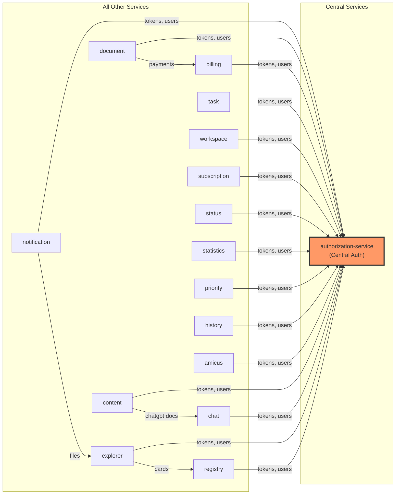
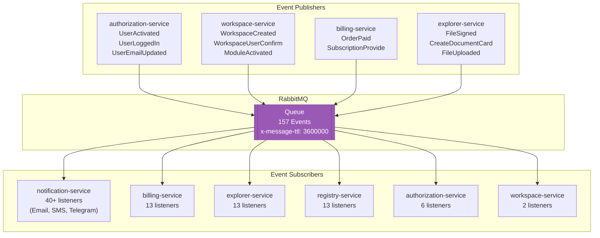
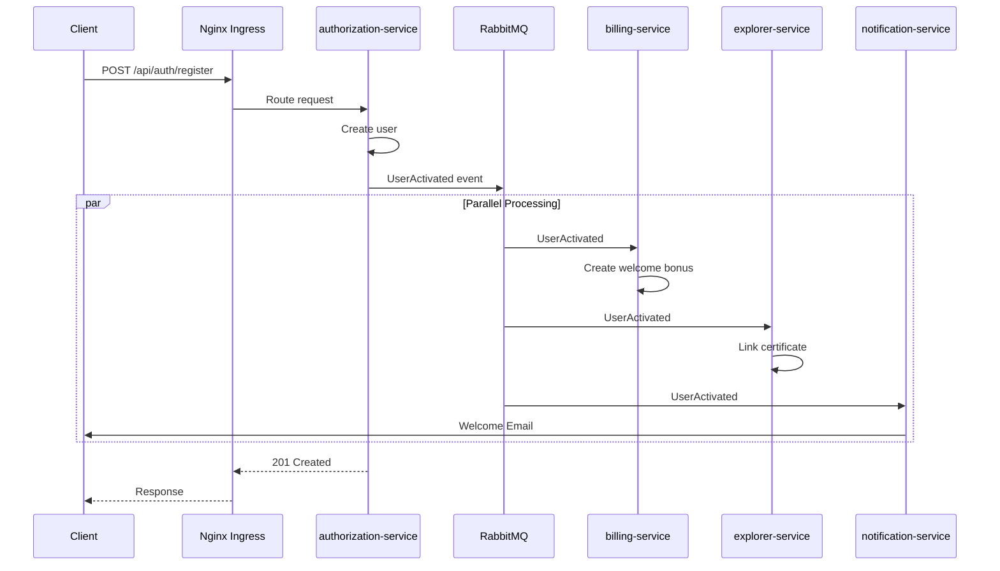
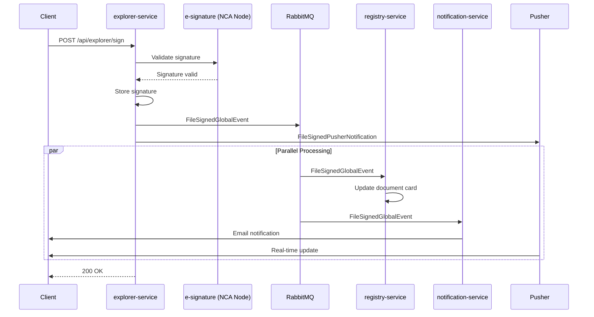
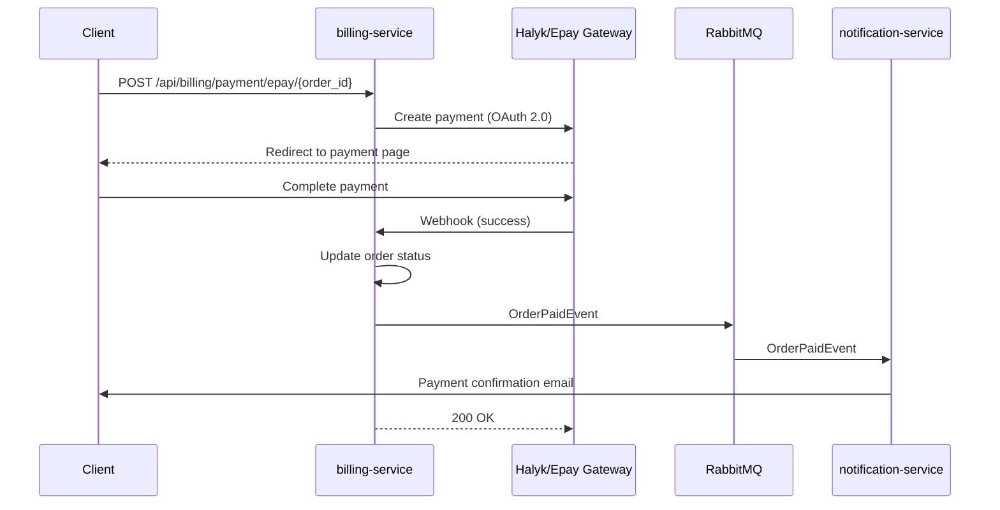
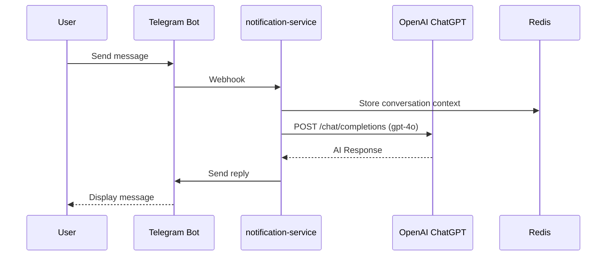
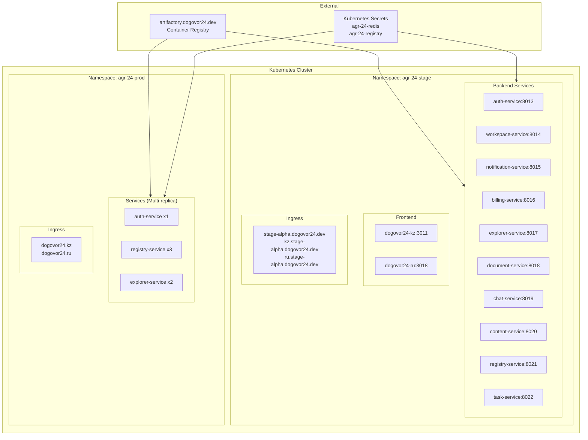

# Dogovor24 Infrastructure Diagram

## Complete System Architecture

```mermaid
flowchart TB
    subgraph External["External Clients"]
        Web["Web Browser<br/>dogovor24.kz/ru"]
        Mobile["Mobile App"]
        API["Third-Party API Clients"]
    end

    subgraph Gateway["API Gateway Layer"]
        direction LR
        Ingress["Nginx Ingress Controller<br/>TLS Termination<br/>cert-manager.io"]
    end

    subgraph Frontend["Frontend Applications (Vue.js/Nuxt.js)"]
        direction LR
        D24_KZ["dogovor24-kz<br/>:3011<br/>Nuxt.js 2.x"]
        D24_RU["dogovor24-ru<br/>:3018<br/>Nuxt.js 2.x"]
        Chat_FE["d24-chat<br/>Vue.js"]
        Amicus_FE["amicus-crm<br/>Vue.js"]
        Constructor["constructor<br/>Vue.js"]
    end

    subgraph Backend["Backend Microservices (PHP/Laravel)"]
        direction TB

        subgraph Core["Core Services"]
            AUTH["authorization-service<br/>:8013<br/>Auth, JWT, Users"]
            WORKSPACE["workspace-service<br/>:8014<br/>Workspaces, Groups"]
        end

        subgraph Business["Business Services"]
            BILLING["billing-service<br/>:8016<br/>Payments, Subscriptions"]
            EXPLORER["explorer-service<br/>:8017<br/>Files, E-Signatures"]
            DOCUMENT["document-service<br/>:8018<br/>Documents, Templates"]
            CONTENT["content-service<br/>:8020<br/>CMS, Constructor"]
            REGISTRY["registry-service<br/>:8021<br/>ESEDO, Cards"]
        end

        subgraph Support["Supporting Services"]
            NOTIFY["notification-service<br/>:8015<br/>Email, SMS, Telegram"]
            CHAT["chat-service<br/>:8019<br/>Messaging, ChatGPT"]
            TASK["task-service<br/>:8022<br/>Tasks, Workflows"]
            SUBSCRIPTION["subscription-service<br/>:8023<br/>Plans, Trials"]
            STATUS["status-service<br/>:8024<br/>Status Tracking"]
        end

        subgraph Auxiliary["Auxiliary Services"]
            STATISTICS["statistics-service<br/>:8025<br/>Analytics"]
            PRIORITY["priority-service<br/>:8026<br/>Prioritization"]
            HISTORY["history-service<br/>:8027<br/>Audit Logs"]
            AMICUS["amicus-service<br/>:8028<br/>CRM, Telephony"]
        end
    end

    subgraph Workers["Worker Services"]
        CONVERTER["converter<br/>:6789<br/>LibreOffice/Node.js"]
        ESIGN["e-signature<br/>:14579<br/>NCA Node/Java"]
        ANTIVIRUS["antivirus-api<br/>Node.js"]
    end

    subgraph Data["Data Layer"]
        direction TB
        PG[("PostgreSQL<br/>:5432<br/>v9.6.11")]
        REDIS[("Redis<br/>:6379<br/>Alpine")]
        ES[("Elasticsearch<br/>:9200<br/>v7.x")]
        MINIO[("MinIO/S3<br/>:9000<br/>File Storage")]
    end

    subgraph MessageBroker["Message Broker"]
        RABBIT[["RabbitMQ<br/>:5672<br/>157 Events | 86 Listeners"]]
    end

    subgraph ExternalAPIs["External Services"]
        direction TB

        subgraph Payments["Payment Gateways"]
            HALYK["Halyk/Epay<br/>Kazakhstan"]
        end

        subgraph Notifications["Notification Services"]
            SENDPULSE["SendPulse<br/>Email/WhatsApp"]
            TELEGRAM["Telegram Bot"]
            SMSC["SMSC<br/>SMS"]
            ZVONOBOT["Zvonobot<br/>IVR Calls"]
            MAILGUN["Mailgun<br/>Transactional Email"]
        end

        subgraph AI["AI Services"]
            CHATGPT["OpenAI ChatGPT<br/>gpt-4o"]
        end

        subgraph CRM["CRM & ERP"]
            BITRIX["Bitrix24 CRM"]
            ONLINEPBX["OnlinePBX<br/>Telephony"]
        end

        subgraph Government["Government APIs"]
            ESEDO["ESEDO/ESUTD<br/>Document Exchange"]
            NCA["NCA PKI<br/>Digital Signatures"]
        end

        subgraph Realtime["Real-time"]
            PUSHER["Pusher<br/>WebSockets"]
        end

        subgraph Analytics["Analytics & Monitoring"]
            GTM["Google Tag Manager"]
            YANDEX["Yandex Metrics"]
            SENTRY["Sentry<br/>Error Tracking"]
        end
    end

    %% External to Gateway
    Web --> Ingress
    Mobile --> Ingress
    API --> Ingress

    %% Gateway to Frontend
    Ingress --> D24_KZ
    Ingress --> D24_RU
    Ingress --> Chat_FE
    Ingress --> Amicus_FE
    Ingress --> Constructor

    %% Gateway to Backend
    Ingress --> AUTH
    Ingress --> WORKSPACE
    Ingress --> BILLING
    Ingress --> EXPLORER
    Ingress --> DOCUMENT
    Ingress --> CONTENT
    Ingress --> REGISTRY
    Ingress --> NOTIFY
    Ingress --> CHAT
    Ingress --> TASK
    Ingress --> SUBSCRIPTION
    Ingress --> STATUS
    Ingress --> STATISTICS
    Ingress --> PRIORITY
    Ingress --> HISTORY
    Ingress --> AMICUS

    %% Service Dependencies
    BILLING --> AUTH
    EXPLORER --> AUTH
    EXPLORER --> REGISTRY
    DOCUMENT --> AUTH
    DOCUMENT --> BILLING
    CONTENT --> AUTH
    CONTENT --> CHAT
    REGISTRY --> AUTH
    REGISTRY --> EXPLORER
    NOTIFY --> AUTH
    NOTIFY --> EXPLORER
    NOTIFY --> REGISTRY
    CHAT --> AUTH
    TASK --> AUTH
    SUBSCRIPTION --> AUTH
    SUBSCRIPTION --> BILLING
    WORKSPACE --> AUTH
    WORKSPACE --> BILLING

    %% Backend to Data
    AUTH --> PG
    WORKSPACE --> PG
    BILLING --> PG
    EXPLORER --> PG
    EXPLORER --> ES
    DOCUMENT --> PG
    CONTENT --> PG
    CONTENT --> ES
    REGISTRY --> PG
    REGISTRY --> ES
    NOTIFY --> PG
    CHAT --> PG
    TASK --> PG
    SUBSCRIPTION --> PG
    STATUS --> PG
    STATISTICS --> PG
    PRIORITY --> PG
    HISTORY --> PG
    AMICUS --> PG

    %% All services use Redis
    AUTH --> REDIS
    BILLING --> REDIS
    EXPLORER --> REDIS
    NOTIFY --> REDIS

    %% File Storage
    EXPLORER --> MINIO
    DOCUMENT --> MINIO
    CONTENT --> MINIO
    TASK --> MINIO

    %% Message Queue
    AUTH --> RABBIT
    WORKSPACE --> RABBIT
    BILLING --> RABBIT
    EXPLORER --> RABBIT
    RABBIT --> NOTIFY
    RABBIT --> BILLING
    RABBIT --> EXPLORER
    RABBIT --> REGISTRY

    %% Worker Services
    DOCUMENT --> CONVERTER
    EXPLORER --> ESIGN
    WORKSPACE --> ESIGN
    REGISTRY --> ESIGN
    EXPLORER --> ANTIVIRUS

    %% External Services
    BILLING --> HALYK
    NOTIFY --> SENDPULSE
    NOTIFY --> TELEGRAM
    NOTIFY --> SMSC
    NOTIFY --> ZVONOBOT
    NOTIFY --> BITRIX
    NOTIFY --> CHATGPT
    NOTIFY --> MAILGUN
    CHAT --> CHATGPT
    CHAT --> PUSHER
    D24_KZ --> PUSHER
    AMICUS --> ONLINEPBX
    REGISTRY --> ESEDO
    ESIGN --> NCA
    D24_KZ --> GTM
    D24_KZ --> YANDEX
    AUTH --> SENTRY

    %% Styling
    classDef core fill:#ff6b6b,stroke:#c92a2a,color:#fff
    classDef business fill:#4ecdc4,stroke:#26a69a,color:#fff
    classDef support fill:#45b7d1,stroke:#0288d1,color:#fff
    classDef data fill:#f9ca24,stroke:#f39c12,color:#333
    classDef external fill:#a29bfe,stroke:#6c5ce7,color:#fff

    class AUTH,WORKSPACE core
    class BILLING,EXPLORER,DOCUMENT,CONTENT,REGISTRY business
    class NOTIFY,CHAT,TASK,SUBSCRIPTION,STATUS support
    class PG,REDIS,ES,MINIO,RABBIT data
```

---

## Service Communication Matrix

### HTTP Dependencies

### Cross-Service HTTP Call Matrix

| Source ↓ / Target → | auth | billing | explorer | notify | registry | workspace | document | chat |
| ------------------- | ---- | ------- | -------- | ------ | -------- | --------- | -------- | ---- |
| **authorization**   | -    |         |          |        |          |           |          |      |
| **billing**         | ✓    | -       |          |        |          | ✓         |          |      |
| **explorer**        | ✓    |         | -        |        | ✓        | ✓         |          |      |
| **notification**    | ✓    |         | ✓        | -      | ✓        | ✓         |          |      |
| **registry**        | ✓    |         | ✓        |        | -        | ✓         |          |      |
| **workspace**       | ✓    | ✓       |          |        |          | -         |          |      |
| **document**        | ✓    | ✓       |          |        |          |           | -        |      |
| **content**         | ✓    |         |          |        |          |           |          | ✓    |
| **chat**            | ✓    |         |          |        |          |           |          | -    |

---

## Event-Driven Architecture (RabbitMQ)

### Key Events and Subscribers

| Event                       | Publisher     | Subscribers                               |
| --------------------------- | ------------- | ----------------------------------------- |
| `UserActivated`             | authorization | billing, explorer, notification, registry |
| `UserLoggedIn`              | authorization | notification                              |
| `UserEmailUpdatedEvent`     | authorization | notification, explorer                    |
| `FileSignedGlobalEvent`     | explorer      | authorization, notification, registry     |
| `CreateDocumentCardEvent`   | explorer      | registry, notification                    |
| `WorkspaceCreatedEvent`     | workspace     | explorer, billing, notification           |
| `WorkspaceUserConfirmEvent` | workspace     | notification                              |
| `OrderPaidEvent`            | billing       | notification                              |
| `SubscriptionProvideEvent`  | billing       | notification                              |

---

## Data Flow Diagrams

### User Registration Flow

### Document Signing Flow

### Payment Processing Flow

### ChatGPT Integration Flow

---

## Kubernetes Deployment Topology

### Deployment Configuration

| Service               | Port  | Health Check | Replicas (Stage) | Replicas (Prod) |
| --------------------- | ----- | ------------ | ---------------- | --------------- |
| authorization-service | 8013  | /ping        | 1                | 1               |
| workspace-service     | 8014  | /ping        | 1                | 1               |
| notification-service  | 8015  | /ping        | 1                | 1               |
| billing-service       | 8016  | /ping        | 1                | 1               |
| explorer-service      | 8017  | /ping        | 1                | 2               |
| document-service      | 8018  | /ping        | 1                | 1               |
| chat-service          | 8019  | /ping        | 1                | 1               |
| content-service       | 8020  | /ping        | 1                | 1               |
| registry-service      | 8021  | /ping        | 1                | 3               |
| task-service          | 8022  | /ping        | 1                | 1               |
| subscription-service  | 8023  | /ping        | 1                | 1               |
| status-service        | 8024  | /ping        | 1                | 1               |
| statistics-service    | 8025  | /ping        | 1                | 1               |
| priority-service      | 8026  | /ping        | 1                | 1               |
| history-service       | 8027  | /ping        | 1                | 1               |
| amicus-service        | 8028  | /ping        | 1                | 1               |
| converter             | 6789  | -            | 1                | 1               |
| e-signature           | 14579 | -            | 1                | 1               |

---

## Infrastructure Components Summary

### Data Stores

| Component          | Technology    | Version | Port | Used By                                          |
| ------------------ | ------------- | ------- | ---- | ------------------------------------------------ |
| **Database**       | PostgreSQL    | 9.6.11  | 5432 | All 16 backend services                          |
| **Cache**          | Redis         | Alpine  | 6379 | All services                                     |
| **Search**         | Elasticsearch | 7.x     | 9200 | explorer, content, registry, document            |
| **Message Queue**  | RabbitMQ      | 3.x     | 5672 | All services (157 events, 86 listeners)          |
| **Object Storage** | MinIO/S3      | -       | 9000 | explorer, document, content, chat, task, billing |

### Indexed Elasticsearch Models

| Service          | Model           | Configurator                  |
| ---------------- | --------------- | ----------------------------- |
| explorer-service | File            | FileConfigurator              |
| content-service  | Content         | ContentIndexConfigurator      |
| registry-service | Dictionary      | DictionaryConfigurator        |
| registry-service | EsedoDictionary | DefaultDictionaryConfigurator |
| document-service | Entity          | EntityConfigurator            |

---

## External Integrations Summary

### Payment Systems

| Service           | Provider   | Integration          |
| ----------------- | ---------- | -------------------- |
| Halyk Bank / Epay | Kazakhstan | REST API (OAuth 2.0) |

### Notification Channels

| Channel   | Provider           | Integration   |
| --------- | ------------------ | ------------- |
| Email     | Mailgun, SendPulse | REST API      |
| SMS       | SMSC               | Custom Driver |
| WhatsApp  | SendPulse          | REST API      |
| Voice IVR | Zvonobot           | REST API      |
| Telegram  | Telegram Bot       | SDK           |

### AI & Automation

| Service            | Provider | Model  |
| ------------------ | -------- | ------ |
| Document Assistant | OpenAI   | gpt-4o |

### CRM & Telephony

| Service | Provider  | Integration |
| ------- | --------- | ----------- |
| CRM     | Bitrix24  | REST API    |
| VoIP    | OnlinePBX | REST API    |

### Government APIs (Kazakhstan)

| Service     | Purpose            | Integration |
| ----------- | ------------------ | ----------- |
| ESEDO/ESUTD | Document Exchange  | SOAP/WSDL   |
| NCA PKI     | Digital Signatures | REST API    |

### Analytics & Monitoring

| Service            | Purpose        |
| ------------------ | -------------- |
| Google Tag Manager | Analytics      |
| Yandex Metrics     | Analytics      |
| Sentry             | Error Tracking |
| PHP-FPM Exporter   | Metrics        |

---

## Shared Packages

| Package                           | Version    | Purpose                              | Used By                      |
| --------------------------------- | ---------- | ------------------------------------ | ---------------------------- |
| `dogovor24/authorization-package` | 1.2.\*     | HTTP client, JWT, AuthRequestService | All services                 |
| `dogovor24/helper-package`        | 1.1.\*     | ApiUrl, ApiNames, utilities          | All services                 |
| `dogovor24/queue-package`         | 1.13.\*    | 157 events, RabbitMQ                 | All services                 |
| `dogovor24/workspace-package`     | 1.1.\*     | WorkspaceService                     | 5 services                   |
| `dogovor24/notification-package`  | 2.0.\*     | Broadcast events                     | notification, explorer       |
| `dogovor24/filter-package`        | dev-master | Data filtering                       | auth, explorer, notification |

---

## Technology Stack

| Layer                  | Technology               | Version |
| ---------------------- | ------------------------ | ------- |
| **Backend Language**   | PHP                      | 7.2+    |
| **Backend Framework**  | Laravel                  | 5.7/5.8 |
| **Frontend Framework** | Vue.js / Nuxt.js         | 2.x     |
| **Frontend Language**  | TypeScript               | -       |
| **Web Server**         | Nginx                    | Latest  |
| **PHP Runtime**        | PHP-FPM                  | 7.2     |
| **Process Manager**    | Supervisord              | 4.x     |
| **Container**          | Docker                   | -       |
| **Orchestration**      | Kubernetes               | 1.x     |
| **CI/CD**              | Bitbucket Pipelines      | -       |
| **Container Registry** | Artifactory              | -       |
| **Monitoring**         | Sentry, PHP-FPM Exporter | -       |

---

## Service Port Reference

| Service                 | Internal Port | API Prefix        | Health Check |
| ----------------------- | ------------- | ----------------- | ------------ |
| authorization-service   | 8013          | /api/auth         | /ping        |
| workspace-service       | 8014          | /api/workspace    | /ping        |
| notification-service    | 8015          | /api/notification | /ping        |
| billing-service         | 8016          | /api/billing      | /ping        |
| explorer-service        | 8017          | /api/explorer     | /ping        |
| document-service        | 8018          | /api/document     | /ping        |
| chat-service            | 8019          | /api/chat         | /ping        |
| content-service         | 8020          | /api/content      | /ping        |
| registry-service        | 8021          | /api/registry     | /ping        |
| task-service            | 8022          | /api/task         | /ping        |
| subscription-service    | 8023          | /api/subscription | /ping        |
| status-service          | 8024          | /api/status       | /ping        |
| statistics-service      | 8025          | /api/statistics   | /ping        |
| priority-service        | 8026          | /api/priority     | /ping        |
| history-service         | 8027          | /api/history      | /ping        |
| amicus-service          | 8028          | /api/amicus       | /ping        |
| converter               | 6789          | /unoconv          | -            |
| e-signature             | 14579         | -                 | -            |
| dogovor24-frontend (KZ) | 3011          | /                 | -            |
| dogovor24-frontend (RU) | 3018          | /                 | -            |

---

## Statistics

| Metric                  | Value                |
| ----------------------- | -------------------- |
| Total Backend Services  | 18                   |
| Total Frontend Apps     | 5                    |
| Shared Packages         | 6                    |
| Events in queue-package | 157                  |
| Event Listeners         | 86+                  |
| Message Broker          | RabbitMQ             |
| Regions Supported       | KZ, RU               |
| Environments            | stage, newprod, prod |
