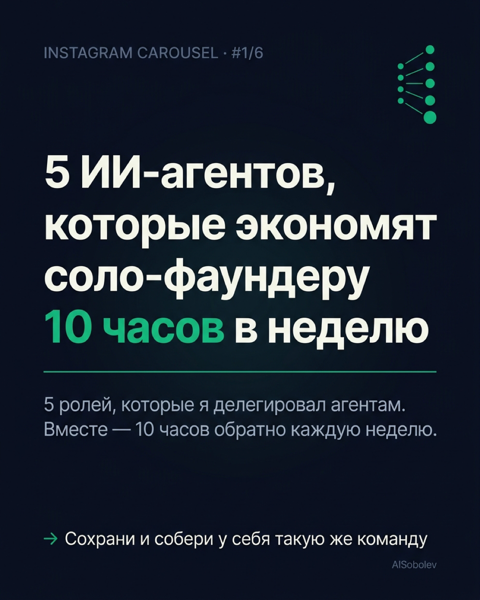
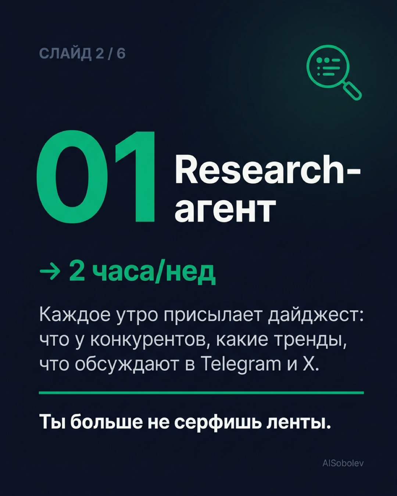
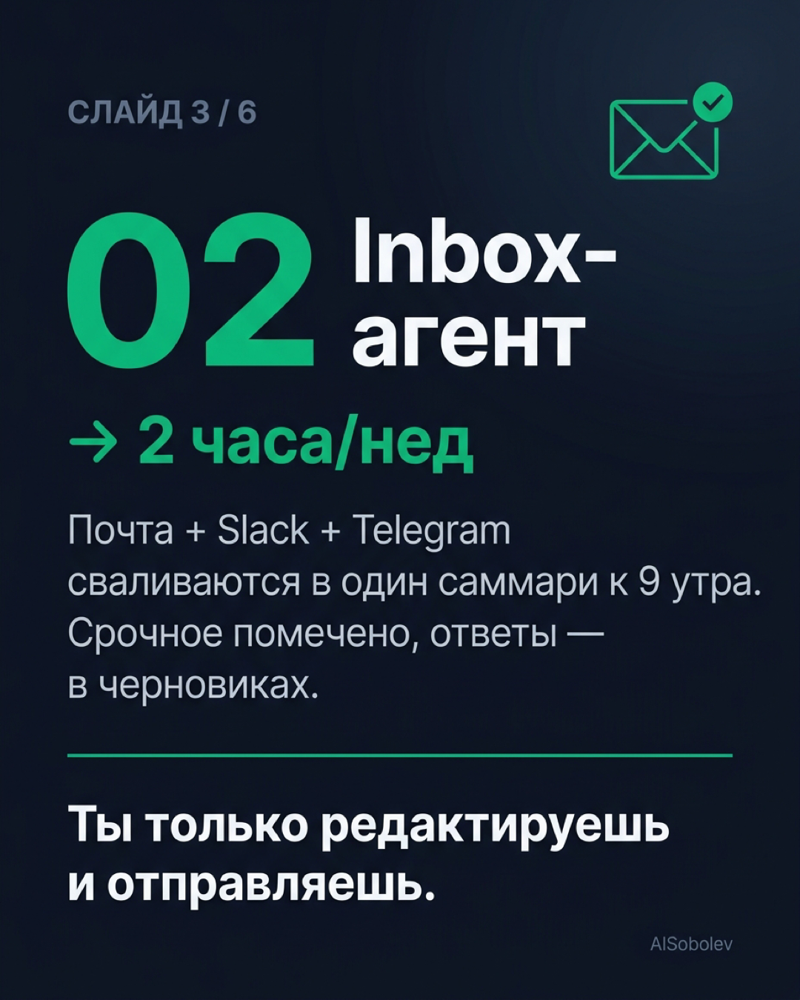
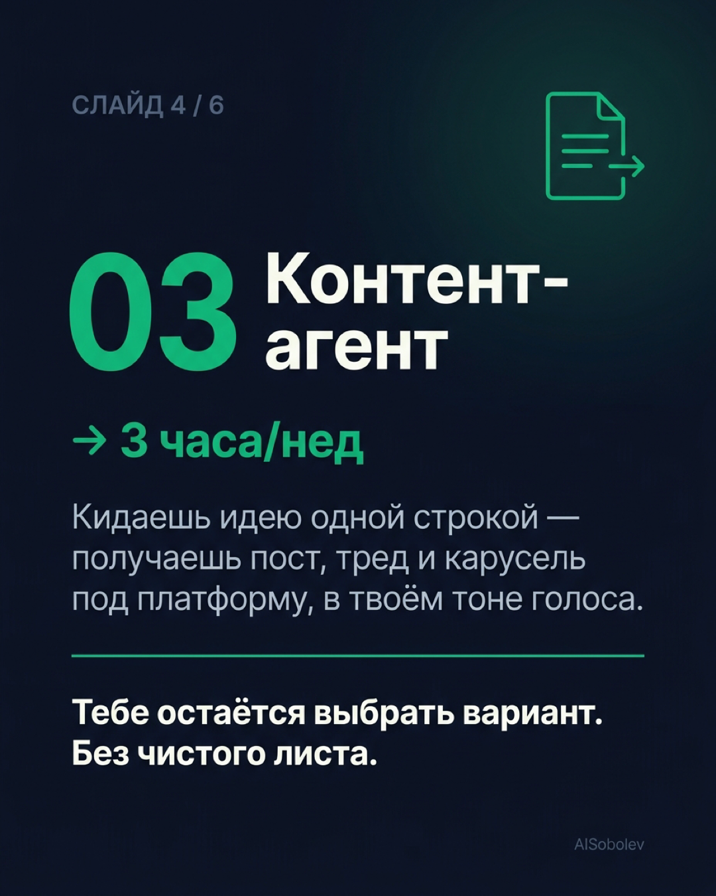
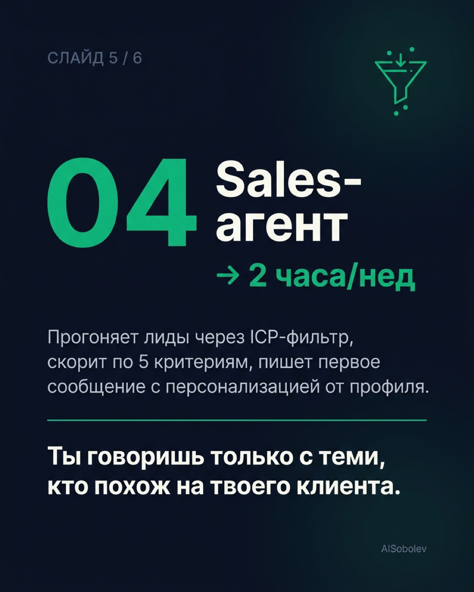
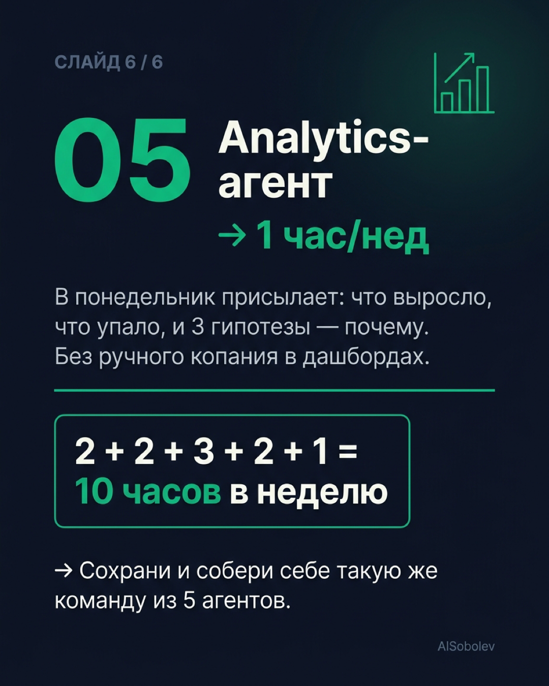

# Instagram-карусель: 5 ИИ-агентов, которые экономят соло-фаундеру 10 часов в неделю

**Платформа:** Instagram (карусель на сохранения)
**Статус:** Черновик — готов к публикации
**Тема выбрана из:** [[instagram-carousels-final-10]] — тема #8
**Слайдов:** 6 | **Структура:** обложка + 5 агентов (CTA встроен в последний слайд)
**Декомпозиция времени:** 2 + 2 + 3 + 2 + 1 = 10 часов/неделя

---

## Финальный текст слайдов

### Слайд 1 — Обложка

**5 ИИ-агентов, которые экономят соло-фаундеру 10 часов в неделю.**

5 ролей, которые я делегировал агентам. Вместе — 10 часов обратно каждую неделю.

Сохрани и собери у себя такую же команду →



---

### Слайд 2 — Research-агент → 2 ч/нед

**1. Research-агент**

Каждое утро присылает дайджест: что нового у конкурентов, какие тренды в нише, что обсуждают в Telegram и X.

Ты больше не серфишь ленты. Открываешь один пост — и за 5 минут в курсе всей недели.

**Экономит: 2 часа/нед.**



---

### Слайд 3 — Inbox-агент → 2 ч/нед

**2. Inbox-агент**

Почта + Slack + Telegram сваливаются в один саммари к 9 утра. Срочное помечено, по остальному уже готовы черновики ответов.

Ты только редактируешь и отправляешь — без часа пролистывания чатов.

**Экономит: 2 часа/нед.**



---

### Слайд 4 — Контент-агент → 3 ч/нед

**3. Контент-агент**

Кидаешь идею одной строкой — получаешь пост, тред и карусель под платформу. Хук, тело, CTA — в твоём тоне голоса.

Тебе остаётся выбрать вариант и опубликовать. Без чистого листа.

**Экономит: 3 часа/нед.**



---

### Слайд 5 — Sales-агент → 2 ч/нед

**4. Sales-агент**

Прогоняет новые лиды через ICP-фильтр, скорит по 5 критериям, пишет первое сообщение с персонализацией от профиля.

Ты разговариваешь только с теми, кто реально похож на твоего клиента.

**Экономит: 2 часа/нед.**



---

### Слайд 6 — Analytics-агент → 1 ч/нед + CTA

**5. Analytics-агент**

В понедельник утром присылает: что выросло, что упало, и 3 гипотезы — почему. Без ручного копания в дашбордах.

Ты приходишь к рабочей неделе с готовыми вопросами, а не с сырыми числами.

**Экономит: 1 час/нед.**

— — —

**Итого: 2 + 2 + 3 + 2 + 1 = 10 часов в неделю.**

Сохрани карусель и собери себе такую же команду из пяти агентов.



---

## Подпись (Instagram caption)

```
Соло-фаундеру не нужна команда из пяти человек. Нужны пять агентов.

Год назад моё утро уходило на ленты, чаты, инбоксы и мета-работу. Сейчас за это отвечают пять агентов, и каждую неделю мне возвращается ~10 часов.

В карусели — кто эти пятеро, что каждый делает и сколько конкретно часов экономит:

→ Research-агент — 2 ч/нед
→ Inbox-агент — 2 ч/нед
→ Контент-агент — 3 ч/нед
→ Sales-агент — 2 ч/нед
→ Analytics-агент — 1 ч/нед

Итого: 10 часов в неделю обратно к тебе.

Сохрани карусель и собери себе такую же команду ⬇️

Какого агента запустишь первым?
```

---

## Хэштеги (12 шт.)

```
#aiагенты #aiagents #солофаундер #solopreneur #aiавтоматизация #aiproductivity #нейросети #aifounder #aiфаундер #buildinpublic #productivityhacks #automation
```

---

## Изображения

Все изображения сгенерированы через nano-banana (Gemini Flash Image), формат 1080×1350 (Instagram portrait), единая палитра и шрифт.

| # | Слайд | Файл |
|---|-------|------|
| 1 | Обложка | `390_Images/2026-04-29-5-ai-agents-solo-founder/slide-01-cover.png` |
| 2 | Research-агент | `390_Images/2026-04-29-5-ai-agents-solo-founder/slide-02-research-agent.png` |
| 3 | Inbox-агент | `390_Images/2026-04-29-5-ai-agents-solo-founder/slide-03-inbox-agent.png` |
| 4 | Контент-агент | `390_Images/2026-04-29-5-ai-agents-solo-founder/slide-04-content-agent.png` |
| 5 | Sales-агент | `390_Images/2026-04-29-5-ai-agents-solo-founder/slide-05-sales-agent.png` |
| 6 | Analytics-агент + CTA | `390_Images/2026-04-29-5-ai-agents-solo-founder/slide-06-analytics-agent.png` |

---

## Связанные документы

- [[instagram-carousels-final-10]] — финальный список 10 тем (тема #8)
- [[2026-04-28 Instagram-карусели для сохранений - 10 тем]] — отбор и обоснование тем
- [[instagram-carousels-brainstorm-15-20]] — пул из 18 кандидатных тем (брейншторм)
- [[2026-04-25 Память для агентов и Ralph Loop]] — соседняя тема: ОС для агентов
- [[2026-02-22 OpenClaw — агент который работает пока ты спишь]] — контекст AISobolev: агенты, работающие фоном
- [[2026-02-16 AI agents это не будущее]] — позиция AISobolev по AI-агентам сегодня
